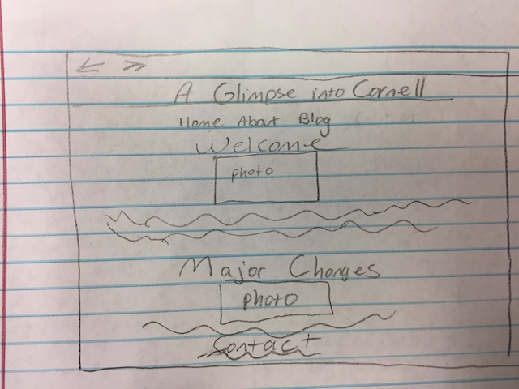
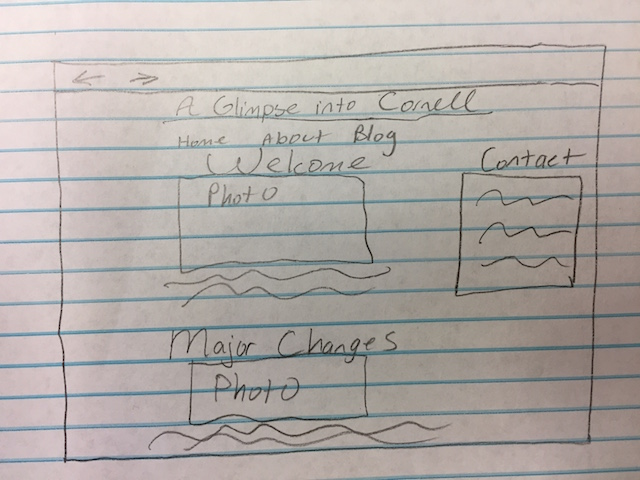

# Project 1 - Design Journey

**For each milestone, complete only the sections that are labeled with that milestone.**

## Markdown Instructions

This is a Markdown file. All written documents that you will submit this semester will be Markdown files. Markdown is a commonly used format by developers and bloggers. It's something that you should know.

The following links are Markdown references:
- <https://guides.github.com/features/mastering-markdown/>
- <https://github.com/adam-p/markdown-here/wiki/Markdown-Cheatsheet>

When writing your Markdown file in Atom. Open the command palette and search for **Markdown Preview: Toggle**. This will open up a panel in Atom where you can preview your formatted Markdown file.

This is how your insert images into your Markdown documents:

## Milestone 1

Make the case for your decisions using concepts from class, as well as other design principles, theories, examples, and cases from outside of class. You can use bullet points and lists, or full paragraphs, or a combo, whichever is appropriate. The writing should be solid draft quality but doesn't have to be fancy.

### Target Audience (Milestone 1)

[Briefly explain who the intended target audience(s) is(are) for your website.]

The intended target audiences of my website consist of prospective students, parents of prospective students, current students, and Cornell alumni. I think these are my targeted audiences since my website is about my experiences and finds at Cornell. For example, a prospective student might be interested in learning about what the general feel of campus is like and what they have to look forward to. Parents of prospective students might be interested in seeing what students at Cornell are like and hearing about the opportunities their child can have access to at Cornell. Current students could look at my website to learn about little treasures Cornell has that they didn't know existed before. Alumni is a target audience because they would look at my website when they are feeling nostalgic for their old college days and if they are curious as to what campus is like now.

### Feel and Features (Milestone 1)

[Briefly describe the feel and features your site will have to cater to those audiences.]

The feel of my website would be a fun and youthful feel since it is about my experiences as a student and that is what my audiences are expecting to see, in order for it to feel authentic. Since parents and alumni are target audiences I would make sure that the feel is also professional and mature by being mindful of what I say. I wouldn't want to alienate my audience in anyway that might turn them off to Cornell.

A lot of the photos I will include will be ones taken at Cornell and relevant to whatever the blog post is about. When I would use photos of campus I would make sure that it would be spots on campus that one could instantly recognize as Cornell, instead of using a photo of an obscure building on campus. This will contribute to the feel that this is a blog about Cornell.

I would like to be able to design this graphic of my website title. I want it at the top of all the pages of the website. By clicking this graphic it will always take the user back to the index.html no matter where the user is on the website. The problem is that I don't know how to design graphics on the computer, so I don't know if this might be too ambitious for me to try to do. This would be helpful for the user since they would already have the mental model to click the graphic because a lot of websites offer this capability.

A feature I would like to have is a navigation bar at the top of the pages that gives the user easy access to the other parts of the website. The navigation bar would have areas where you can click to go to the home page, and blog. A navigation bar would act as visibility for my audience since it will show them what is available to see on my site easily. Some features I would like to include is that when you go to the blog page it will show all of the blog posts listed in order so then the user can scroll through to choose a blog to read. Then if the user clicks the photo for a particular blog post it takes the user to the another page that has the entire blog post.

I may even embed videos I took from the Cornell Harvard hockey game into my site, since having this video feature would help the audiences to see the energy of Cornell.

### Final Content (Milestone 1)

[Briefly describe the content you plan to include in the final submission, and why it's the right content for those audiences.]

The content I plan to make for my final submission consists of a home page, and at least 3 blogs. Some ideas for blog posts I have range from talking about the Cornell Harvard Game, deciding to change my major, my favorite spot on campus, and getting a private tour of the E.B. White Collection. Why I think these topics for blogs would be right for my audiences is that it will give a glimpse into life at Cornell and as a college student in general. The Cornell Harvard Game is a quintessential part of Cornell that all Cornellians live for, which would be helpful for those looking into Cornell to know what campus life is like. Plus, it makes current students and alumni feel connected to the university. The blog about deciding to change my major is something a lot of people in my audiences can relate to since it's a pretty normal thing and it would be good for prospective students to know that they don't have to stick to the major they came with. Plus, it would make prospective parents aware that their kid shouldn't feel pressured to stick to a major once arriving at Cornell as a freshman. My favorite spot on campus and getting a private tour of the E.B. White Collection have to do with my love for history and how I know tons about Cornell history. I want to include these blogs since few people at Cornell really know Cornell history, so it would be great to educate my audiences on the little treasures Cornell has that you might not even realize is there.
The main point I want to get across to my audiences is that Cornell has so much to offer and that even though we all have different experiences at Cornell, we are connected to each other as Cornellians.

## Milestone 2

Make the case for your decisions using concepts from class, as well as other design principles, theories, examples, and cases from outside of class.

For the blog.html page I had the titles and pictures be clickable links since I know that users have a mental model of being able to click titles or photos to go to other parts of a website. I've seen this technique used on other people's websites. I created a navigation bar at the top of the page since usually that is where the user would go to look for the links to change the pages.

### Target Audience (Milestone 2)

[A clearer description of audience: who are they, what are they interested in with respect to this site, and what are the design goals for that audience.]

As I've looked over my blog posts it seems that my audience is really more prospective students since I found that I explain some things that current Cornell students would know like the ILRie stereotype. Prospective students are probably interested in what you can do at Cornell that is unique to Cornell and what campus life is like. The design goals for this audience is to make the site youthful and not too serious. And I want it to be a simple site that is very easy to figure out how to use.
### Site Theme (Milestone 2)

[A description of your overall site theme and why it's appropriate for the audience.]

My overall site them will be Cornell themed. I'm planning on using red and white as my main colors. This would be appropriate since this blog is about Cornell geared towards prospective students.

### Navigation (Milestone 2)

[A description of how you generated and considered alternatives for the site's navigation.]

I generated my main navigation at the top since that is usually where it can be found on most websites. I know the main pages on my site are the home page and blog page that has a list of all my blog posts. Then to access certain blogs I made the title and pictures clickable links. I at first considered making the text of the previews of the blog be clickable, but I thought that would look sort of messy having an entire sentence be a link. Once I use CSS I can make the title of the blog bigger and use the pseudo-class :hover to make the picture appear more clickable for the user.

### Organization (Milestone 2)

[An explanation of how you came to the organization and content that you chose.]

The content I chose was the stuff that I thought would be most interesting to my audience that they hadn't heard about. I didn't want to do cliché stuff that people had heard about. I chose content that best describes my unique experiences at Cornell since I doubt many people get the game winning photo of the Cornell Harvard Game or request a private tour the E.B. White Collection. The way I organized it was that every blog post can be found on the blog page so that the user can scroll through and see what posts are available to read.

## Milestone 3

Make the case for your decisions using concepts from class, as well as other design principles, theories, examples, and cases from outside of class.

Remember to focus on the things we can't see just by looking at the site: changes, alternatives considered, processes, and justifications.

Each section is probably around 1 reasonably sized paragraph (3-5 sentences).

### Changes from Milestone 2 (Milestone 3)

[What changes did you make from Milestone 2 to content/information/navigation, and why?]

From Milestone 2 a major change I made was to change my index.html and I added an About page. My index.html originally did not have a lot going on. So, this time I decided to leave in the Welcome paragraph and add in a section to the page of contact information. Also, I put in the most "recent" blog post, which is the one called Major Changes. I did this because I noticed that on a lot of blogs the home page includes the full length blog post of the most recent one. The About page that includes more general personal information that tells the audience why I chose Cornell.

### Visual Design (Milestone 3)

[Discuss your visual designs: how did you come to them, what are their strengths and weaknesses, how do they fit your overall design goals and audiences?]

I wasn't sure how embellished I wanted to make my site, so I made two versions one that was simple and the other that has a lot of embellishments. My overall design goal was to try to figure out how to make my site sort of Cornell themed, but also including part of my personality into it since this website is about my experiences at Cornell. Version 1 I decided to make a bit more simplistic and is strictly Cornell colors. Version 1's weakness is probably that it is too simple, which makes it uninteresting to look at. It's strengths is that from looking at it prospective students (my audience) can clearly tell this is about Cornell red and white color scheme. Version 2 has more embellishments to the text and I played more with the color scheme.  A worry with version 2 is that I may have played too much with the color scheme too much that it doesn't clearly show it is a Cornell blog. My reasoning though for version 2 was to use different variations of red to make the page more interesting for the user to look at visually, rather than having it be one color red like in version 1. Since this is a blog I spaced out the lines for the paragraphs and chose easy to read fonts like serif and monospace because I know that my audience doesn't want to have a hard time reading the article like if it was in cursive. Thus, I chose speciality fonts like fantasy and cursive for headers since those are short.

### Emotion (Milestone 3)

[Emotion is a big part of design. What emotions where you thinking about or trying to convey in your designs?]

I want to convey excitement and convey some kind of authenticity that this is based off of my own personal experience. Excitement can be conveyed in my site by using a bright colors like white and different shades of red. For authenticity that's when I thought up version 2 by making something that isn't too expected or cliché. I feel like the simplistic red and white is very overdone and that it wouldn't stand out from someone else's blog about Cornell, which is why I decided to use various shades of red. My main goal is to make a site that a user can go to and feel like they can trust me and know that I'm not being paid to say what I am saying. I feel like using warmer colors helps to create that feeling of trust too.

## Final Submission - Rationale

This rationale should be polished writing: one you might submit as a report to a client or boss to help explain the project and convince them you did a good job. You'll be surprised how much writing and communicating you need to do about projects and choices on internships and jobs; practice that here.

It should be a comprehensive, complete story of the project. You might find that each section run several paragraphs (1-3). Sketches can often help tell the story of your design. Screenshots are also useful for describing issues discovered during user testing and how you addressed them. Quotes from your users during testing are also very powerful when explaining your rationale.

Your rationale should be a polished version of the earlier rationales.

### Changes from Milestone 3 (Final Submission)

- Changes since Milestone 3 and why, particularly ones you learned from testing.

A change I have made from Milestone 3 is that I've decided that version 1 of my styles documents is the best for my users. Before testing I was uncertain about, which one to use because the color schemes were very different and created a different feeling when the user opened it. At first, I preferred version 2 because it matched my personal style more. Yet, from user testing I learned that what I like is not what's best for the user. The user's needs come before my aesthetic preferences. One of the testers said that version 2 was "confusing to look at if this was suppose to be a blog about Cornell" and that version 1 looked more "official".

I created a separate page for my contact information. I originally had it on the bottom of the homepage and here's a sketch of what it originally looked like.

The problem with my original idea was that during my user testing both users had a hard time being able to send me an email from the link on the website. They had missed it on the homepage because they didn't expect the contact information to be on the bottom of the page after the blog post. The way I had it was that the contact information was sort of hidden due to all of the other content on the homepage.
To combat this I came up with another design idea.

I ended up choosing not to use this design idea because when I implemented it on my page it didn't look right. The contact information sort of just looked like it was randomly thrown onto the page.
Therefore, I decided to make a separate contact page for my website. This decision made the most sense because it wouldn't make my homepage look too crowded with content. Also, it's the easiest way for the user to get in contact with me because they can just go to this page through the navigation bar instead of scrounging around the homepage for it.

### Audience (Final Submission)

[A complete and polished description of the intended audience(s) for your website.]

The audience for my website are prospective students. This is because I've noticed that in some of my blog posts I explain things that I would not have to explain to a current Cornell student about. For example, in the beginning of my blog post about the Cornell Harvard hockey game I explained about how it was a big deal and how we throw fish onto the ice. If my audience was a current Cornell student I wouldn't have to explain those things, but since I do my audience is geared towards prospective students.

Because my audience is prospective students they could be deciding whether or not to choose Cornell over another Ivy League. Thus, in my About page I wrote under the heading "My Story" about why I chose Cornell. Plus, the content I have is geared towards prospective students as I talk about what Cornell student life is like, the history behind the school, and how resources on campus are accessible. Because I know that these are prospective students  I am very careful with what I say on my website. I don't want them to get a negative feeling about the school based off of something I say and that what I said could possibly bias them against Cornell. I'd like the experience on my website to be a positive one that enthusiastically explains the best Cornell has to offer.

### Design Goals (Final Submission)

[An explanation of the design goals for that audience, based on your earlier rationales.]

My design goals was to create a website that looked clean and portrayed to my audience a sense of trust. Also, I wanted my audience to feel Big Red Spirit when they came to my website. I had originally thought that I would be able to create sense of trust by trying to distance my design away from the traditional Cornell colors of red and white. However, I learned that my users wanted those colors because with those colors came a sense of officialness and made my website look like it was made by a Cornell student. I realized it's because that's what they were familiar with when it came to Cornell, those classic red and white colors. Familiarity creates trust and comfort.

Since I knew that my audience was prospective students I made sure that the photos I included were from on campus. It didn't make sense to me to include photos from let's say Arizona because that doesn't relate to Cornell at all.

Prospective students are already stressed out by schoolwork and college decisions, thus, I knew that I wanted to make a website that was simple and easy to use. I wanted the content to flow and be placed in areas on the website that made the most sense. I didn't want to include content that would be deemed as just fluff. I wanted to only include content that was pertinent and straight to the point.

### Navigation (Final Submission)

[An explanation of how the final navigation met your goals and why its appropriate for your audience(s).]

For navigation I wanted it to be easy to go from one page to another on my website. First off, I know that my audience has a mental model of a navigation bar and being able to use that to go to different pages. Therefore, I made a navigation bar that goes to the 4 main pages of my website, which are the home page, blog page, about page, and contact page. On every page there is the title of the website "A Glimpse into Cornell" and I know that on a lot of websites if you click the title of the website it takes you back to the index.html. Therefore, because I know that my audience are prospective students who are all young and very familiar with using websites I implemented this feature because they have a mental model of this already.

The main blog page has multiple navigation features. I provided multiple ways for the user to be able to choose a blog post to read. I did this by making the title and photo that correspond to a particular blog post clickable links. The reason is that I have seen before on websites that the title of the blog post is clickable and even the photo is clickable. Thus, my audience can click either the title or photo to go to the full blog post that corresponds with that title or photo. I know my audience has probably thought about these capabilities because we are not that far apart in age and we all grew up in a time where the internet was easily accessible to us.

### Organization (Final Submission)

[An explanation of how the final organization met your goals and why its appropriate for your audience(s).]

The way I organized my page was to split all my content into categories.
The home page has an introduction to what the website is about and the most "current" blog post. The reason I decided to put the introduction on the home page is because that is the first page that my audience will see and I want my audience from the start to understand what this website is about. Also, I included the most current blog on the home page because that helps to get the user interested as to what blogs exist on the website and encourages the user to go the blog page to see what other blogs exist.

The about page is split up into a general "About" section and then a section called "My Story" that is more in depth. I organized my about page this way because I felt that it would make sense to have a brief introduction to myself so my audience can quickly get to know who I am before going in depth as to why I chose Cornell. I decided to include that brief introduction before diving in deep because it would be overwhelming for my audience to immediately see a big long page of text. So, I thought that a short introduction would make the page appear more approachable to my audience.

The blog page takes the user to the list of all the blog posts that appear on my website, so that they can scroll through it and decide which ones to read. I thought this would be the best way to organize the blog content because I know that prospective students are busy. If they can just go to one spot on the website and quickly scroll through to see if they find anything that interests them on one page it would make life easier for them. I had originally thought of grouping my blog posts into categories, but right now I don't have enough blog posts to group them into categories that are similar to one another. That would have to be something I do in the future once I have more blog posts.

The contact page is pretty much straight forward. It's just a photo of me with links to my LinkedIn and email address. I didn't think there needed to be really anything else on that part of the website because I feel like my audience is just going to find extra stuff frivolous. If they go there they are looking specifically for contact information nothing else.

### Visual Design (Final Submission)

[An explanation of how the final design met your goals and why its appropriate for your audience(s).]

The main take away I have from design goals in how important it is to think about the audiences perspective, rather than your own. The final design I went with was a Cornell themed website with the red and white. What I liked about this visual design is that it is very clean and crisp and there isn't a crazy amount going on. Also, prospective students really are not looking for anything that's crazy fancy. Rather, they probably would prefer a simplistic design that is straight to the point instead of one that has too much embellishment.

Since this is a blog I know that my users will be doing a lot of reading. This is why I chose fonts such as monospace for my paragraphs and serif for my lists. These fonts are best for when the user has to read large portions of text and they make skimming pages easier. Plus, I increased the space between the lines to make the paragraphs and list elements easier to read. On the blog posts just to add a touch of embellishment to make the page look a little more interesting, I increased the size of the first letter on every blog post. For strong statements I chose to make those bold so that they would stand out a lot. For statements that needed to be emphasized I decided to make those italicized because I wanted them to stand out, but I didn't want them to stand out as much as the strong statements.

I played with the margins in my final design to make different sections on pages look distinct from one another. This can be seen on the home page and about page. The margin space for the introduction on the pages are smaller than the other content on the page, such as the current blog post and "My Story" paragraphs. I feel that this helped to create distinctness in these sections of going from a very general topic to a more in depth topic. Plus, these margin differences help to make the audience take notice of the other section.

On each of the blog posts I chose to change the margins from the default one because I didn't like how, originally, the text extended all the way from the left to the right. I decided to increase the margin because I think it helps to make the blog posts easier to read quicker. Since when the lines on the page are long it gets hard to keep track as to what line you are on and then you end up reading an entire line by accident. But, if the lines are shorter it's easier to read.

For the blog page I cleaned it up more my centering the images in the list of blog posts. Originally I had the image aligned to the left, but I felt that with it being centered it created a cleaner look. Furthermore, with it being in the center the photos would catch the eyes of my audience more.
